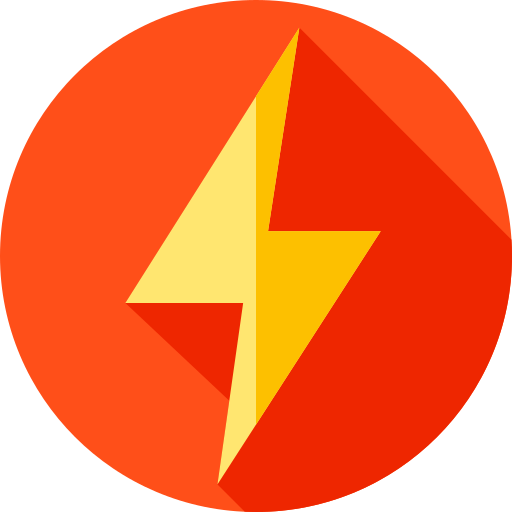

<meta charset="utf-8">
<h1 align="center"> 
    <h1 align="center"> Lightning Typer </h1>
    
</h1>

 

<!--  -->
  
  
  

  <a href="#rocket-tecnologias">Tecnologias</a>&nbsp;&nbsp;&nbsp;|&nbsp;&nbsp;&nbsp;
  <a href="#-projeto">Projeto</a>&nbsp;&nbsp;&nbsp;|&nbsp;&nbsp;&nbsp;
  <a href="#-layout">Layout</a>&nbsp;&nbsp;&nbsp;|&nbsp;&nbsp;&nbsp;
  <a href="#-como-contribuir">Como contribuir</a>&nbsp;&nbsp;&nbsp;|&nbsp;&nbsp;&nbsp;
  <a href="#memo-licença">Licença</a>

 

  <!-- 
  imagem do projeto no browser -->

## :rocket: Tecnologias

Esse projeto foi desenvolvido com as seguintes tecnologias:

- [jQuery](https://jquery.com)
- [Ajax](https://api.jquery.com/jquery.ajax/)
- [Materialize](https://materializecss.com)
- [Tooltipster](https://iamceege.github.io/tooltipster/)

## 💻 Projeto

O LightningTyper é um projeto que visa testar suas habilidades de datilográfia para que você possa aprimorar-se usando-o, e consiga digitar cada vez mais rápido.

## 🔖 Layout

Você pode visualizar o layout do projeto no formato através >em breve o link será inserido aqui<. Lembrando que você irá precisar ter uma conta no [Figma](http://figma.com/).

## ♻️ Como contribuir

- Faça um fork desse repositório;
- Cria uma branch com a sua feature: `git checkout -b minha-feature`;
- Faça commit das suas alterações: `git commit -m 'feat: Minha nova feature'`;
- Faça push para a sua branch: `git push origin minha-feature`.

Depois que o merge da sua pull request for feito, você pode deletar a sua branch.

## :memo: Licença

Esse projeto ainda não possui licença alguma, pois não está completo.

 <!-- Veja o arquivo [LICENSE](LICENSE.md) para mais detalhes. -->

---

Em desenvolvimento por <strong>João Bispo 😎 </strong> 

